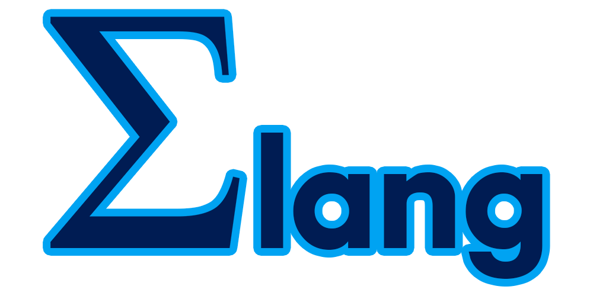

  
Language for embedded programming.

**Sigma**'s phisolophy is: when the language is not overcomplicated developer can fastly start to **understand** how the language works and how to optimize the programs. 

**Sigma** is object oriented programming language with manual memory managment system. It supports generics, classes, inheritance, interfaces, abstract classes and namespaces.

**Sigma** is a simple language. Remember that language called Go? Go is designed to be **as simple as possible**. This is not the same as being **not overcomplicated**. That is why Go is not that much scalable and is used in microservices.

# Installation
> Not made

# Documentation
> Not made

# Progress
> Nothing much